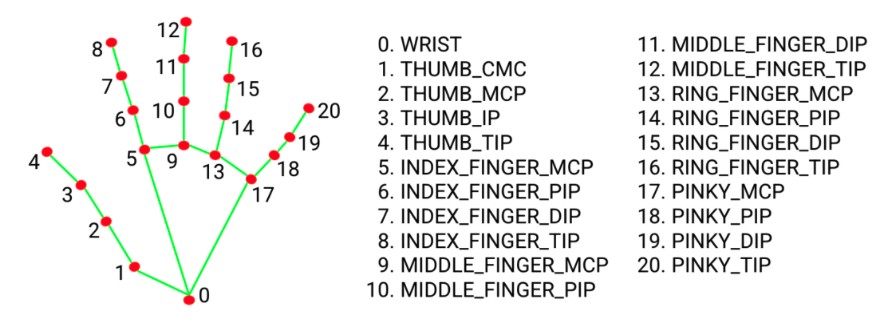
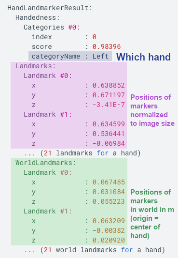

# Hand Feature Detection

For each hand, twenty one feature markers get detected: 

## Output Data

The output data for one image is structured in the following way:

OUtput data is saved in json format in the file feature_outputs.json.